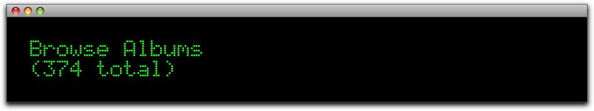
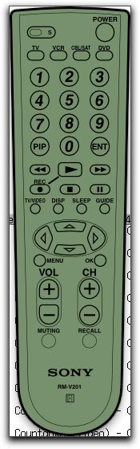

# Introduction

The [SLiMP3](http://wiki.slimdevices.com/index.php/SLIMP3) device is an incredible feat of engineering and design.
Released in 2001, it lets you access and play your entire MP3 music collection without physically accessing your
computer. A media server, written in Perl, streams music data to the SLiMP3 device, where it is converted into analog
and made available on a stereo connection. A remote control that comes with the unit is all that you use to select what
to play and to control playback. If not one of the first network media players, it was definitely one of the coolest,
with a retro display look reminicsent of Casio devices from the 80s.

And one of the best things about the server software, written by Sean Adams and Dean Blackketter, is that it is open
source, released under the GPL.

Although I have used my glorious SLiMP3 without issue for many years, I recently decided that the server software was
overkill for my needs. My music library is all in Apple's iTunes, and I thought it would be a cool to use the original
SLiMP3 device as a controller and interface for the iTunes program running on my Apple MacMini (G4), with audio coming
directly from the MacMini, not the SLiMP3. And so, after a week or two of hacking in Python, I now release to the
world: Pyslimp3.

# Dependencies

For iTunes control, Pyslimp3 relies on the incredible
[Python appscript](http://appscript.sourceforge.net/py-appscript/index.html) package that "is a high-level,
user-friendly Apple event bridge that allows you to control scriptable Mac OS X applications using ordinary Python
scripts."

Of course, Pyslimp3 also requires [Python](http://www.python.org) (at least 2.5.1 but not yet 3.0).

The `qtsim` SLiMP3 simulator (see below) depends on the [Qt library](http://qt.io). There is a text-only simulator as
well (`sim.py`). Note that neither the Pyslimp3 server (`Server.py`) nor `sim.py` depends on Qt; only the `qtsim`
application.

Finally, Pyslimp3 has been tested only against the *original* SLiMP3 device and the included *Sony* remote control. It
should not be too much work to adapt the code to other devices and remotes.

# Starting

To start the Pyslimp3 server (from the Pyslimp3 source directory):

    python Server.py

The Pyslimp3 should be able to locate your iTunes Music Library XML file, read it, and begin displaying information on
any SLiMP3 device connected to your local network.

# How to Operate

See the [documentation](wiki/TopBrowser) in the project wiki. A list of the keys on the Sony RMV201 remote and what
they do in Pyslimp3 is found [here](wiki/KeyMappings).

# Simulators

The code base also contains two very simple simulators that will display screens from the server and provide minimal
emulation of Sony remote control. One version is a graphical application, built with [Qt library](http://qt.io). It is
found in the `qtsim` directory. To build,

    cd qtsim
    qmake
    make

The other simulator is a bare-bones text-based one. To run:

    python sim.py

You can type in one-letter commands in the simulator to simulate remote control keys (be sure to press RETURN after the
letter). The following lists the currently-supported keys/actions:

*Letter* | *Action*
-------- | --------
q | Power on/off
, (comma) | Volume up
. (period) | Volume down 
s | Stop iTunes playback
p | Begin iTunes playback
P | Pause iTunes playback
f | Next track
w | Previous track
u | Up arrow
l | Left arrow
d | Down arrow
r | Right arrow
S | Toggle SHUFFLE mode
R | Toggle REPEAT mode
D | Show playback screen
M | Toggle MUTE
H | Show top-level browser
i | Show album or track ratings
0-9 | Enter a digit

# Additional Information

The Wiki tab contains additional documentation for Pyslimp3. Start with the TopBrowser page to see the screens
available once you "power on" the device. Check out KeyEventProcessing for a discussion of how it handles remote
control key events. A related page, TelephoneKeypadProcessing, describes how to enter text using the numeric keypad
found on the remote.
